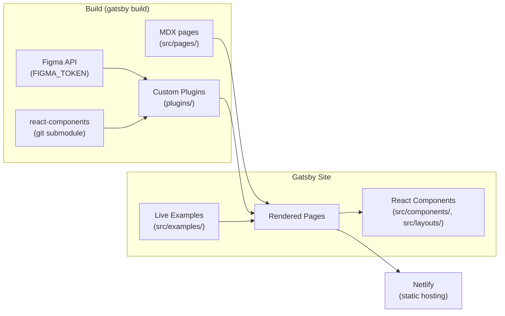

# Garden Website — Architecture

## System Overview

The Garden website is a Gatsby-based static site that documents the [Zendesk Garden](https://garden.zendesk.com) design system. It renders MDX documentation pages, live React component examples, auto-generated component API docs, and design/pattern guidelines. Content is sourced from MDX files, a `react-components` git submodule, and the Figma API. The site is deployed to Netlify.

## Architecture Diagram

## Component Map

| Directory | Responsibility |
|-----------|---------------|
| `src/pages/` | MDX + TSX pages — route-mapped to URL paths (`/components/`, `/design/`, `/patterns/`, `/content/`) |
| `src/examples/` | Live interactive React examples embedded in MDX pages |
| `src/components/` | Shared site-wide React components (`Layout`, `Provider`, `SEO`) |
| `src/layouts/` | Page layout shells: `Root`, `Sidebar`, `Titled`, `Home`, `MaxWidth` |
| `src/icons/` | Site-specific SVG icons |
| `plugins/` | Custom Gatsby plugins (see below) |
| `content/` | Static data — `nav/` YAML files for sidebar navigation, `figma/` assets, `news/` |
| `react-components/` | Git submodule — source of component prop types and versions (read-only) |
| `utils/` | Build/deploy scripts (`upgrade.js`, `deploy.mjs`) |

### Custom Plugins

| Plugin | Purpose |
|--------|---------|
| `gatsby-source-garden-content` | Sources nav YAML and news content into GraphQL |
| `gatsby-source-garden-docgen` | Parses `react-components` submodule to generate component prop API data via GraphQL |
| `gatsby-remark-figma-assets` | Downloads and inlines Figma images during build |
| `gatsby-transformer-garden-svg` | Transforms SVG files for use in the site |
| `gatsby-algolia-docsearch` | Indexes pages for Algolia DocSearch |

## Page Content Flow

1. `gatsby-source-garden-docgen` parses TypeScript source in `react-components/` → GraphQL nodes (`gardenReactComponent`, `gardenReactPackage`)
2. `gatsby-source-garden-content` reads `content/nav/*.yml` → GraphQL navigation nodes
3. `gatsby-remark-figma-assets` fetches images from Figma API using `FIGMA_TOKEN` during MDX processing
4. MDX pages in `src/pages/` define frontmatter (`title`, `description`, `package`, `components`, `subcomponents`)
5. `gatsby-node.ts` sets up redirects and injects `pageContext` (slug, group, frontmatter) into each page
6. `src/components/Layout.tsx` selects the appropriate layout shell (sidebar + TOC) based on `pageContext`
7. Live examples from `src/examples/` are imported directly into MDX using standard ES imports; raw source is imported via `!!raw-loader!` for the code block display

## Key Design Decisions

### MDX as Documentation Format
All component/design/pattern pages are MDX files. This allows prose, live React examples, and JSX components (like `<Usage>`) to coexist in one file without a separate CMS.

### react-components as Git Submodule
The `react-components` repo is a read-only submodule. The `gatsby-source-garden-docgen` plugin parses its TypeScript source to auto-generate component API reference tables, ensuring docs stay in sync with the component library.

### FIGMA_TOKEN Required at Build Time
Figma images are fetched during `gatsby build` via `FIGMA_TOKEN`. Local dev also requires this token. See `.github/CONTRIBUTING.md`.

### Path Aliases for src/components and src/layouts
`tsconfig.json` defines `components/*` and `layouts/*` path aliases to avoid deep relative imports throughout the codebase.

## External Dependencies

| Service | Purpose | Config |
|---------|---------|--------|
| Figma API | Design asset images | `FIGMA_TOKEN` env var |
| Netlify | Static hosting + deploy previews | `NETLIFY_TOKEN`, `NETLIFY_SITE_ID` env vars |
| Algolia DocSearch | Site search | `gatsby-algolia-docsearch` plugin |
| Google Analytics | Page analytics | `UA-970836-25` (gatsby-plugin-google-gtag) |
